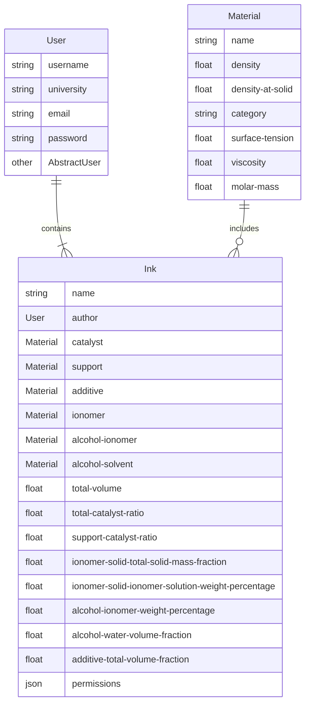

The original goal of this website was to develop a GUI tool for the standardization of fuel cell catalyst inks. Multiple people
in the lab had used different units and had their own methods for developing the "recipe" for a catalyst. Althrough the original
idea was a local GUI, I had the idea of making it cloud based instead of sitting on a drive somewhere. For this reason, Django was chosen
as the ideal framework for the development of this website. It allows secure and easy implementation of the needed ideas and support for
custom API calls.

## Structure
The structure of the django models works to ensure that each ink was fully dynamic. If a material changed or a user's information changed,
it had to update automatically for the rest of the website.

In addition to these models, there were also some APIs that handled GET and POST requests related to the materials, inks, and users.

For the users, the base User model was used with some customization to allow for the user to select their university.

For the materials, there were pages to see all the materials available with pagination.

For the inks, there were several different types of requests available.

### GET Methods
 1. The first GET APICall returned a file describing the math from an AWS S3 bucket.
 2. all_inks would filter out the inks that the signed-in user has access to and then return a paginated view 
 3. ink_detail would return information about the ink, including performing all the necessary calculations for research

### POST Methods
 1. add_inks adds an ink to the list of inks using a form

### PUT Methods
 1. Edits an existing ink that the user is an author of

---

## Considerations Taken
The first consideration taken was to ensure confidentially of the project. Multiple different teams would be publishing their
work to the website and permissions to view data was considered. To ensure utmost privacy, inks had to be manual shared by adding
the users emails into an access list. This list was only available to the author of the ink object.

As I was handling users personal data such as name, email, and passwords, all the personal data is encrypted. Furthermore, all
inputs that interact with the server are sanitized.

---

